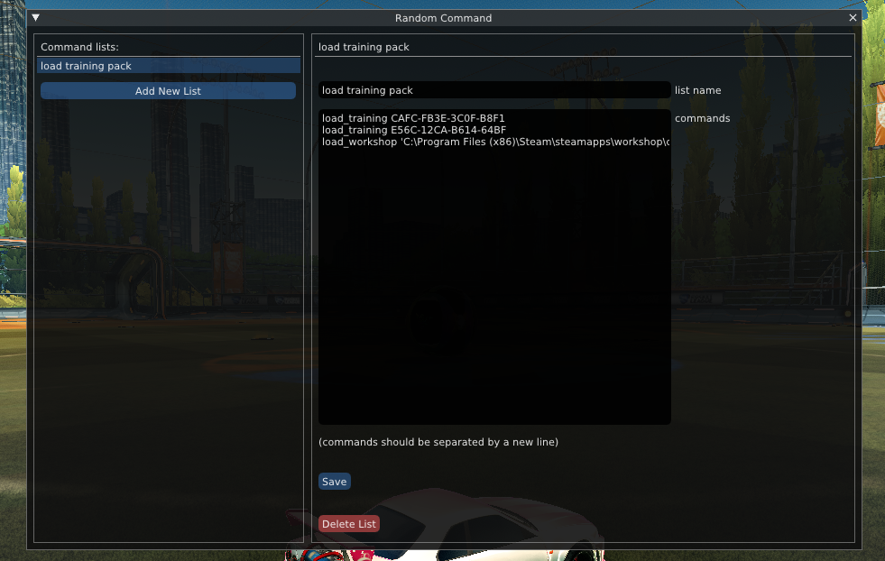

# RandomCommand (BakkesMod plugin)
BakkesMod plugin to run a random command from a predefined list

## Usage
Create command lists in the `Command List Menu`

Run or bind `randomCommand "your command list name"` to run a random command from that list

>[!TIP]
>A larger list will make the commands seem more random (less repetition)

## Installation
Find the latest version in [Releases](https://github.com/smallest-cock/RandomCommand/releases)